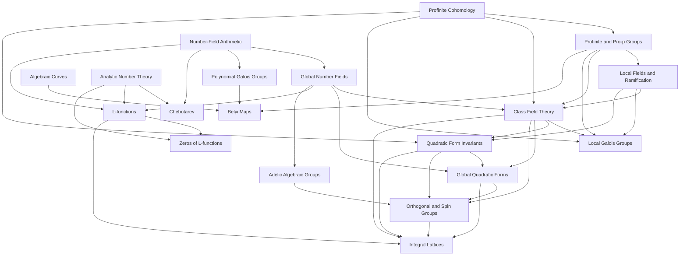

# Dependency graph

Accepted roadmaps such as Contour Integration, Reductive Groups, Spin Representations,
Universal Covers, and Conformal Mapping are omitted from the diagram but are named in the
individual dependency tables.
